<h2>TensorFlow-FlexUNet-Image-Segmentation-Whole-Heart-HVSMR-2016 (2025/11/25)</h2>
<!--
<h3>Revisiting HVSMR 2016: MICCAI Workshop on Whole-Heart and Great Vessel Segmentation from
 3D Cardiovascular MRI in Congenital Heart Disease </h3>
-->
<h3><h3>Revisiting HVSMR 2016: MICCAI Workshop on Whole-Heart and Great Vessel Segmentation</h3>
Toshiyuki Arai 
Software Laboratory antillia.com 
 

This is the first experiment of Image Segmentationfor  for <b>Whole Heart HVSMR 2016</b> based on 
our <a href="./src/TensorFlowFlexUNet.py">TensorFlowFlexUNet</a>
 (<b>TensorFlow Flexible UNet Image Segmentation Model for Multiclass</b>)
, and a 512x512 pixels PNG 
<a href="https://drive.google.com/file/d/1UF6KeiLHL_i326AV7PHKUQQbWq48RPFL/view?usp=sharing">
<b>Whole-Heart-B-MRI-ImageMask-Dataset.zip</b></a>
which was derived by us from   
<b>training</b> dataset in 
<a href="https://github.com/scouvreur/WholeHeartMRISegmenter">
Whole Heart MRI Segmenter
</a> 
(from <b>HVSMR 2016: MICCAI Workshop on Whole-Heart and Great Vessel Segmentation from 3D Cardiovascular MRI in Congenital Heart Disease 
    <a href="https://segchd.csail.mit.edu/data.html">challenge</a>
</b>).
  
Please see also our experiment 
<a href="https://github.com/sarah-antillia/TensorFlow-FlexUNet-Image-Segmentation-Whole-Heart-HVSMR-2.0">
TensorFlow-FlexUNet-Image-Segmentation-Whole-Heart-HVSMR-2.0
</a>
  

<b>Actual Image Segmentation for Images of 512x512 pixels</b> 
As shown below, the inferred masks predicted by our segmentation model trained on our dataset appear similar to the ground 
truth masks. 
<b>rgb_map (Myocardium:red, Blood Pool:green, Aorta:dark-grey, Pulmonary Arteries:white)</b>     

 
<table>
<tr>
<th>Input: image</th>
<th>Mask (ground_truth)</th>
<th>Prediction: inferred_mask</th>
</tr>
<tr>
<td>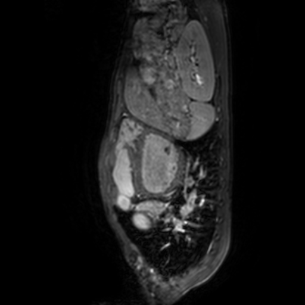</td>
<td>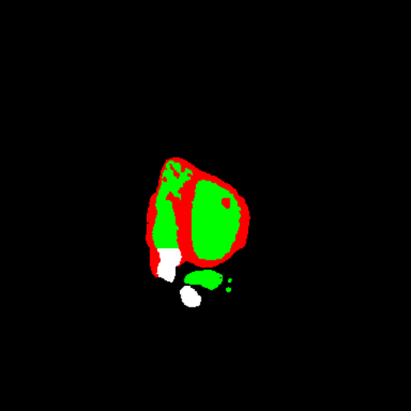</td>
<td></td>
</tr>
</tr>
<td>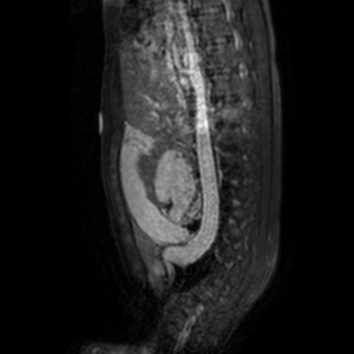</td>
<td></td>
<td></td>
</tr>
<tr>
<td>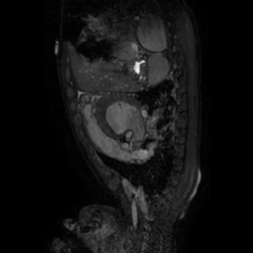</td>
<td></td>
<td></td>
</tr>
</table>

 
<h3>
1 Dataset Citation
</h3>
The dataset used here was derived from <b>training</b> dataset in 
<a href="https://github.com/scouvreur/WholeHeartMRISegmenter">
Whole Heart MRI Segmenter
</a> 
(<b>HVSMR 2016: MICCAI Workshop on Whole-Heart and Great Vessel Segmentation from 3D Cardiovascular MRI in Congenital Heart Disease 
    <a href="https://segchd.csail.mit.edu/data.html">challenge</a>
</b>).
  
<b>License</b> 
<a href="https://github.com/scouvreur/WholeHeartMRISegmenter?tab=MIT-1-ov-file#readme">
MIT license
</a>
 
 
The following explanation was taken from   
<a href="https://segchd.csail.mit.edu/data.html">
<b>HVSMR 2016: MICCAI Workshop on Whole-Heart and Great Vessel Segmentation from 3D Cardiovascular MRI in Congenital Heart Disease</b>    
</a>
  
<b>Data</b> 
<b>MR Acquisition</b> 
The 3D cardiovascular magnetic resonance (CMR) images were acquired during clinical practice at Boston Children’s Hospital, Boston, MA, USA. Cases include a variety of congenital heart defects. Some subjects have undergone interventions.

Imaging was done in an axial view on a 1.5T scanner (Phillips Achieva) without contrast agent using a steady-state free precession (SSFP) pulse sequence. Subjects breathed freely during the scan, and ECG and respiratory-navigator gating were used to remove cardiac and respiratory motion (TR = 3.4 ms, TE = 1.7 ms, α = 60˚). Image dimension and image spacing varied across subjects, and average 390 x 390 x 165 and 0.9 x 0.9 x 0.85 mm, respectively, in the full-volume training dataset. 
 
<b>Segmentation</b> 
Manual segmentation of the blood pool and ventricular myocardium was performed by a trained rater, and validated by two clinical experts. Segmentations were done in an approximate short-axis view and then transformed back to the original image space (axial view). Manual segmentation was done considering all three planes, but the quality of the segmentation in the short-axis view was the deciding factor.

The blood pool class includes the left and right atria, left and right ventricles, aorta, pulmonary veins, pulmonary arteries, and the superior and inferior vena cava. Vessels (except the aorta) are extended only a few centimeters past their origin: this is because vessels that are too long are disruptive when the 3D heart surface models are used for surgical planning. The myocardium class includes the thick muscle surrounding the two ventricles and the septum between them. Coronaries are not included in the blood pool class, and are labeled as myocardium if they travel within the ventricular myocardium.
 
 
<b>Attribution</b> 
If you use this data as part of a research paper, please cite the following paper:
<ul>
<li>
D.F. Pace, A.V. Dalca, T. Geva, A.J. Powell, M.H. Moghari, P. Golland, “Interactive whole-heart segmentation in congenital heart disease”, Medical Image Computing and Computer Assisted Interventions (MICCAI 2015), Lecture Notes in Computer Science; 9351:80-88, 2015.
</li>
</ul>
<b>Data</b> 
<b>The challenge system and data are no longer available.</b>
  
<h3>
2 Whole-Heart ImageMask Dataset
</h3>
<h4>2.1 Download PNG ImageMask Dagtaset</h4>
 If you would like to train this Whole-Heart Segmentation model by yourself,
 please download <a href="https://drive.google.com/file/d/1UF6KeiLHL_i326AV7PHKUQQbWq48RPFL/view?usp=sharing">
 <b>Whole-Heart-B-MRI-ImageMask-Dataset.zip </b></a>
on the google drive, expand the downloaded, and put it under dataset folder to be:
<pre>
./dataset
└─Whole-Heart-B
    ├─test
    │  ├─images
    │  └─masks
    ├─train
    │  ├─images
    │  └─masks
    └─valid
        ├─images
        └─masks
</pre>
<b>Whole-Heart Statistics</b> 
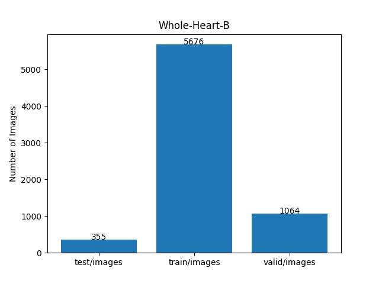 
 
As shown above, the number of images of train and valid datasets is large enough to use for a training set of our segmentation model.
  
<h4>2.2 PNG ImageMask Dataset Derivation</h4>
The folder structure of 
<b>training</b> dataset in 
<a href="https://github.com/scouvreur/WholeHeartMRISegmenter">
Whole Heart MRI Segmenter
</a>  is the following. 
<pre>
./training
 ├─training_axial_full_pat0.nii.gz
 ├─training_axial_full_pat0_label_A.nii.gz
 ├─training_axial_full_pat0_label_B.nii.gz
 │  
 ... 
 ├─training_axial_full_pat9.nii.gz
 ├─training_axial_full_pat9_label_A.nii.gz
 └─training_axial_full_pat9_label_B.nii.gz
</pre>
We used the following 2 Python scripts to generate our PNG dataset.
<ul>
<li><a href="./generator/ImageMaskDatasetGenerator.py">ImageMaskDatasetGenerator.py</a></li>
<li><a href="./generator/split_master.py">split_master.py</a></li>
</ul>

We used all <i>training_axial_full_pat*.nii.gz</i> and <i>training_axial_full_pat*_label_B.nii.gz</i> files in 10 patients <b>training</b> folder 
 to generate the dataset, and the following class and color mapping table to generate colorized masks files for 4 classes from the <i>label_B.nii.gz</i> files. 
You may change this color mapping table in the Generator Python script according to your preference.
  
<table border="1" style="border-collapse: collapse;">
<tr><th>Mask Pixel</th><th>Class</th><th>Color </th><th>BGR triplet</th></tr>
<tr>
<td>1</td><td>Myocardium:</td><td>red</td><td>(0,0,255)</td><tr>
<td>2</td><td>Blood Pool</td><td>green</td><td>(0,255,0)</td><tr>
<td>64</td><td>Aorta</td><td>dark gray</td><td>(110,110,110)</td><tr>
<td>71</td><td>Pulmonary Arteries</td><td>white</td><td>(255,255,255)</td><tr>
</table>
 
 
<h4>2.3 ImageMask Dataset Sample</h4>
<b>Train_images_sample</b> 
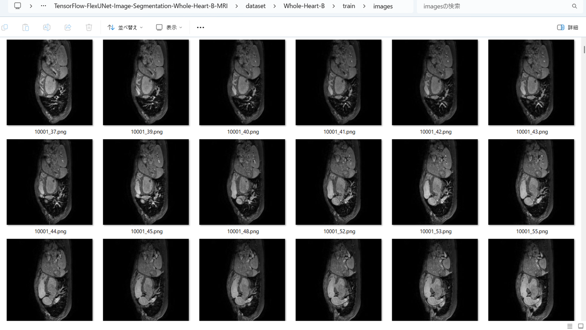
 
<b>Train_masks_sample</b> 
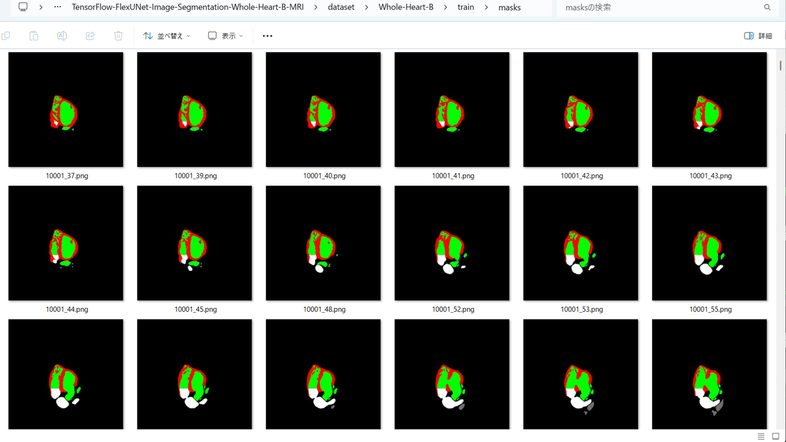
 
 
<h3>
3 Train TensorFlowFlexUNet Model
</h3>
 We trained Whole-Heart TensorFlowFlexUNet Model by using the following
<a href="./projects/TensorFlowFlexUNet/Whole-Heart-B/train_eval_infer.config"> <b>train_eval_infer.config</b></a> file.  
Please move to ./projects/TensorFlowFlexUNet/Whole-Heart-B, and run the following bat file. 
<pre>
>1.train.bat
</pre>
, which simply runs the following command. 
<pre>
>python ../../../src/TensorFlowFlexUNetTrainer.py ./train_eval_infer.config
</pre>

<b>Model parameters</b> 
Defined a small <b>base_filters = 16</b> and large <b>base_kernels = (7,7)</b> for the first Conv Layer of Encoder Block of 
<a href="./src/TensorFlowFlexUNet.py">TensorFlowFlexUNet.py</a> 
and a large num_layers (including a bridge between Encoder and Decoder Blocks).
<pre>
[model]
image_width    = 512
image_height   = 512
image_channels = 3

num_classes    = 5

base_filters   = 16
base_kernels   = (7,7)
num_layers     = 8
dropout_rate   = 0.05
dilation       = (1,1)

</pre>

<b>Learning rate</b> 
Defined a very small learning rate.  
<pre>
[model]
learning_rate  = 0.00007
</pre>

<b>Online augmentation</b> 
Disabled our online augmentation.  
<pre>
[model]
model         = "TensorFlowFlexUNet"
generator     = False
</pre>

<b>Loss and metrics functions</b> 
Specified "categorical_crossentropy" and <a href="./src/dice_coef_multiclass.py">"dice_coef_multiclass"</a>. 
You may specify other loss and metrics function names. 
<pre>
[model]
loss           = "categorical_crossentropy"
metrics        = ["dice_coef_multiclass"]
</pre>
<b>Learning rate reducer callback</b> 
Enabled learing_rate_reducer callback, and a small reducer_patience.
<pre> 
[train]
learning_rate_reducer = True
reducer_factor     = 0.5
reducer_patience   = 4
</pre>

<b>Early stopping callback</b> 
Enabled early stopping callback with patience parameter.
<pre>
[train]
patience      = 10
</pre>

<b>RGB Color map</b> 
rgb color map dict for Whole-Heart 1+4 classes.
<pre>
[mask]
mask_datatype    = "categorized"
mask_file_format = ".png"
;                 Myocardium:red, Blood Pool:green, Aorta:dark-grey, Pulmonary Arteries:white 
rgb_map = {(0,0,0):0,(255,0,0):1,(0,255,0):2, (110,110,110):3, (255,255,255):4,}       
</pre>

<b>Epoch change inference callback</b> 
Enabled <a href="./src/EpochChangeInferencer.py">epoch_change_infer callback (EpochChangeInferencer.py)</a></b>. 
<pre>
[train]
epoch_change_infer       = True
epoch_change_infer_dir   =  "./epoch_change_infer"
num_infer_images         = 6
</pre>

By using this callback, on every epoch_change, the inference procedure can be called
 for 6 images in <b>mini_test</b> folder. This will help you confirm how the predicted mask changes 
 at each epoch during your training process.    

<b>Epoch_change_inference output at starting (epoch 1,2,3)</b> 
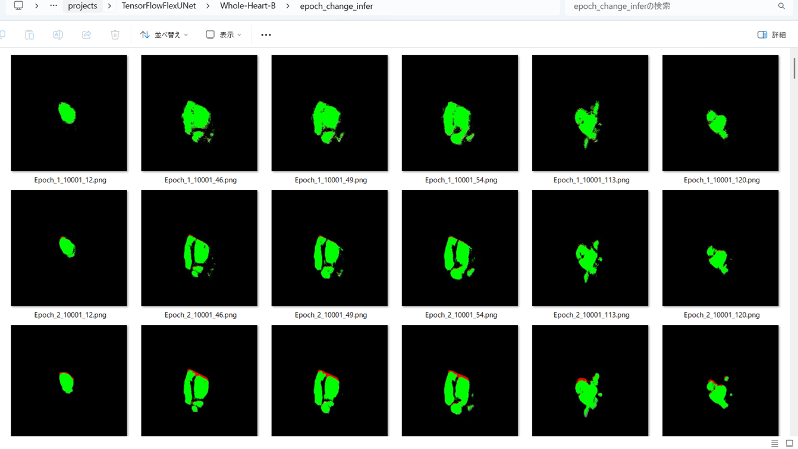 
 
<b>Epoch_change_inference output at middlepoint (epoch 23,24,25)</b> 
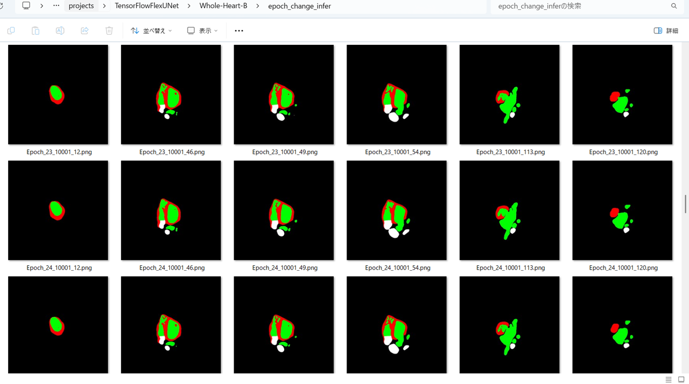 
 

<b>Epoch_change_inference output at ending (epoch 48,49,50)</b> 
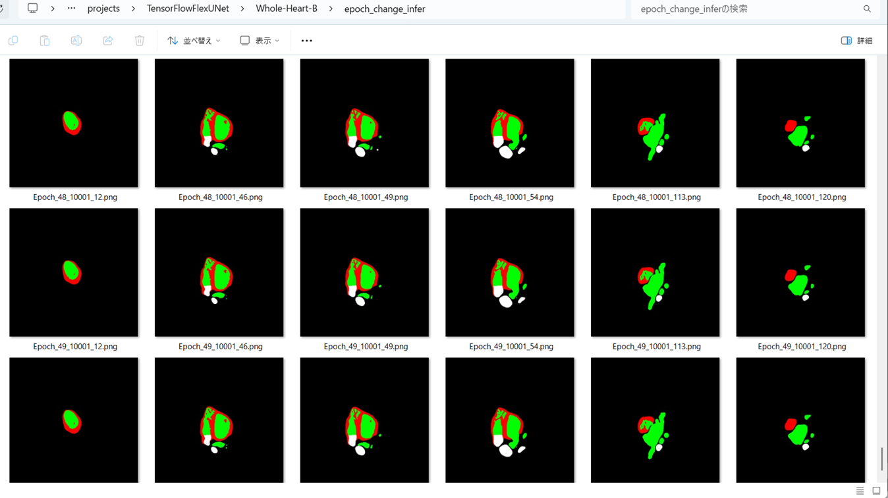 
 

In this experiment, the training process was terminated at epoch 50.  
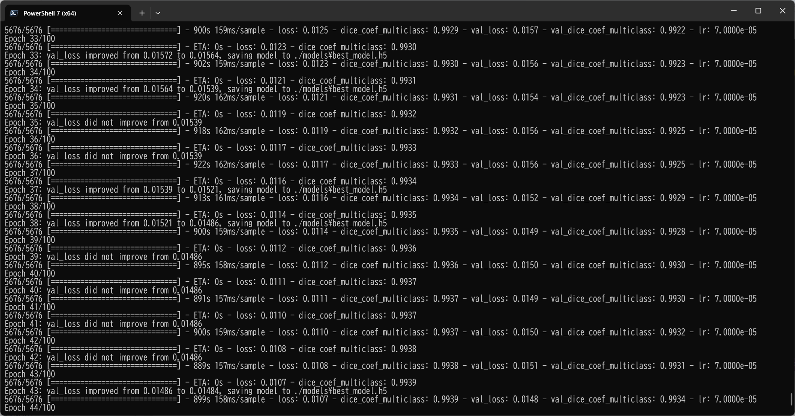 
 

<a href="./projects/TensorFlowFlexUNet/Whole-Heart-B/eval/train_metrics.csv">train_metrics.csv</a> 
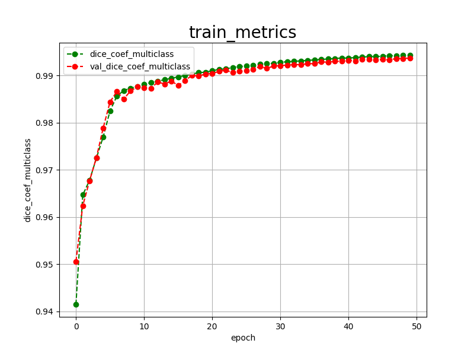 

 
<a href="./projects/TensorFlowFlexUNet/Whole-Heart-B/eval/train_losses.csv">train_losses.csv</a> 
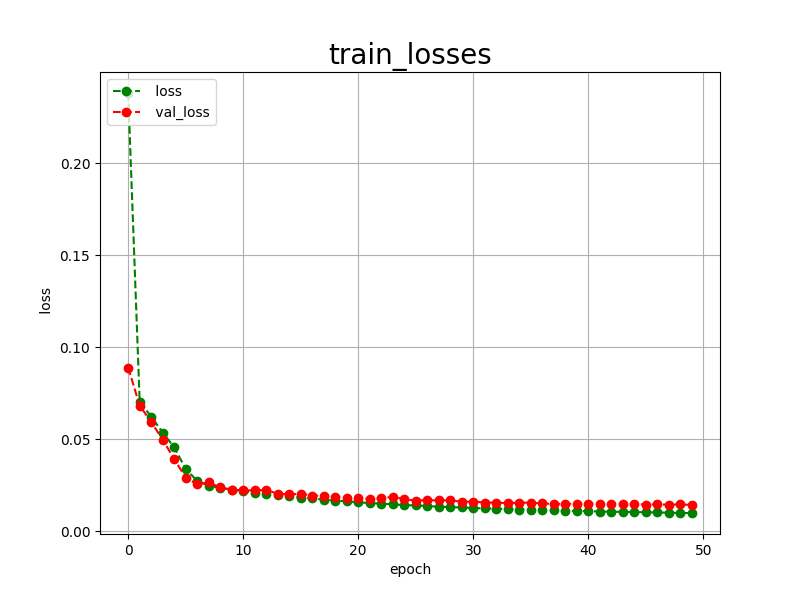 
 
<h3>
4 Evaluation
</h3>
Please move to a <b>./projects/TensorFlowFlexUNet/Whole-Heart-B</b> folder,
and run the following bat file to evaluate TensorFlowUNet model for Whole-Heart. 
<pre>
./2.evaluate.bat
</pre>
This bat file simply runs the following command.
<pre>
python ../../../src/TensorFlowFlexUNetEvaluator.py ./train_eval_infer.config
</pre>

Evaluation console output: 
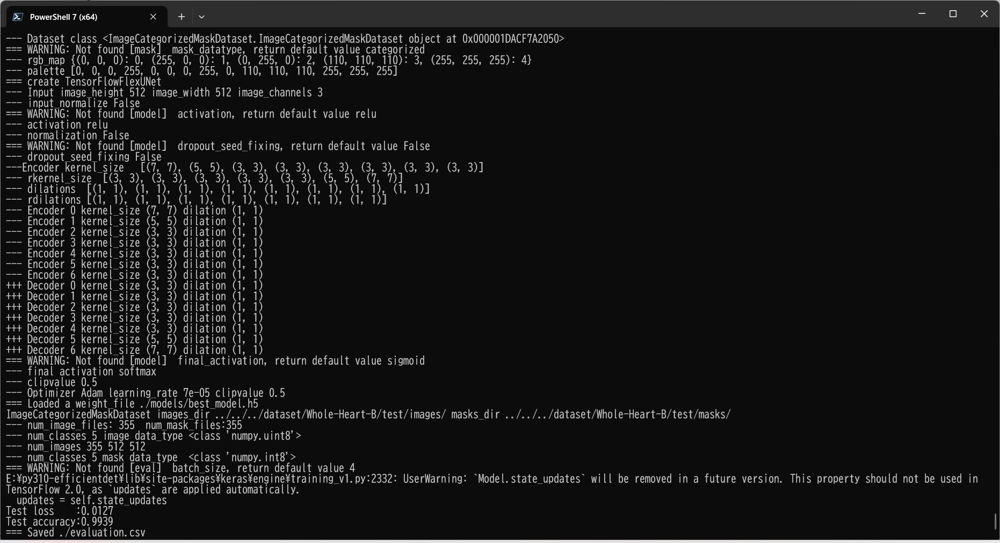
  Image-Segmentation-Whole-Heart

<a href="./projects/TensorFlowFlexUNet/Whole-Heart-B/evaluation.csv">evaluation.csv</a> 

The loss (categorical_crossentropy) to this Whole-Heart-B/test was low, and dice_coef_multiclass very high as shown below.
 
<pre>
categorical_crossentropy,0.0127
dice_coef_multiclass,0.9939
</pre>
 
<h3>
5 Inference
</h3>
Please move to a <b>./projects/TensorFlowFlexUNet/Whole-Heart-B</b> folder
, and run the following bat file to infer segmentation regions for images by the Trained-TensorFlowFlexUNet model for Whole-Heart. 
<pre>
./3.infer.bat
</pre>
This simply runs the following command.
<pre>
python ../../../src/TensorFlowFlexUNetInferencer.py ./train_eval_infer.config
</pre>

<b>mini_test_images</b> 
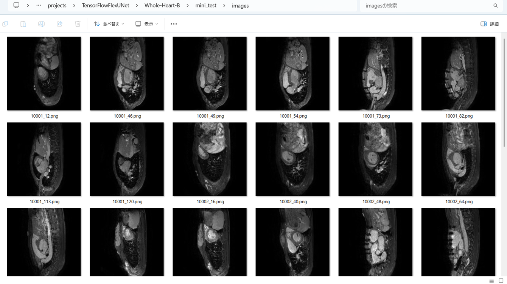 
<b>mini_test_mask(ground_truth)</b> 
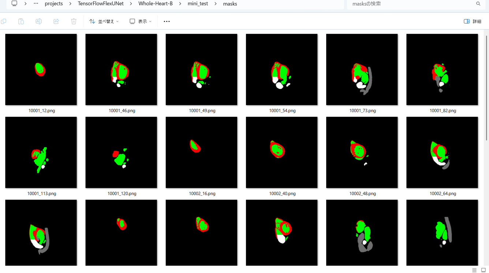 

<b>Inferred test masks</b> 
 
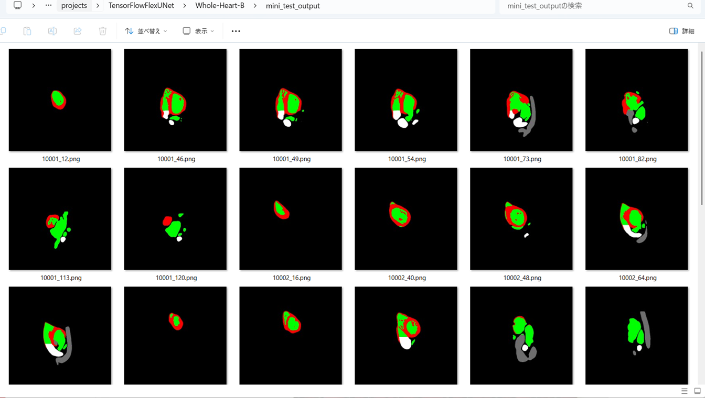 
 

<b>Enlarged images and masks for Images of 512x512 pixels </b> 
<b>rgb_map (Myocardium:red, Blood Pool:green, Aorta:dark-grey, Pulmonary Arteries:white)</b>     

<table>
<tr>
<th>Image</th>
<th>Mask (ground_truth)</th>
<th>Inferred-mask</th>
</tr>

<td>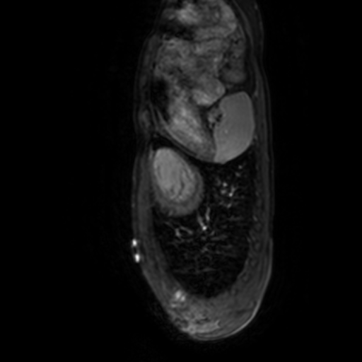</td>
<td>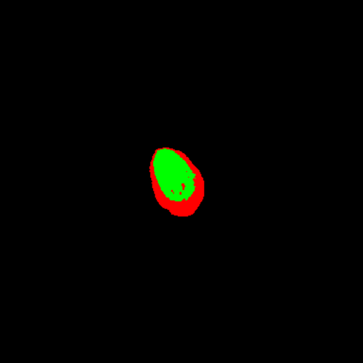</td>
<td>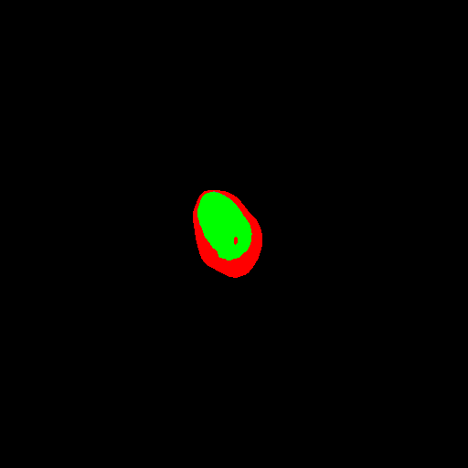</td>
</tr>
<tr>
<td>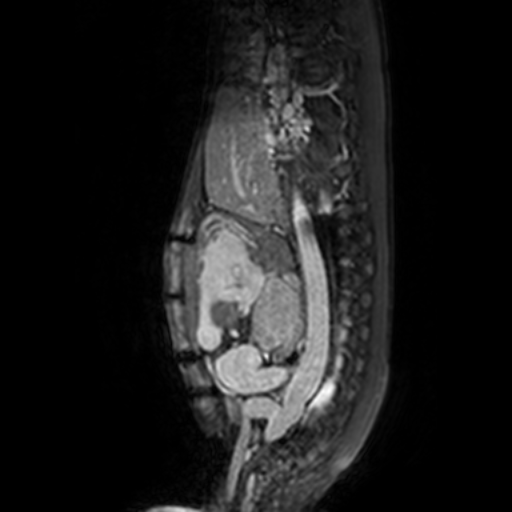</td>
<td></td>
<td>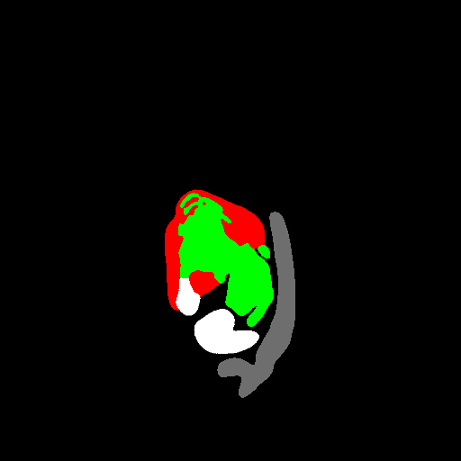</td>
</tr>
<tr>
<td>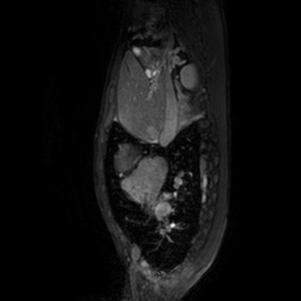</td>
<td></td>
<td></td>
</tr>

<tr>
<td>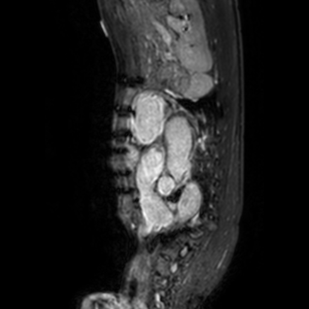</td>
<td></td>
<td>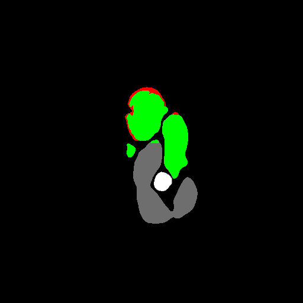</td>
</tr>
<tr>
<td>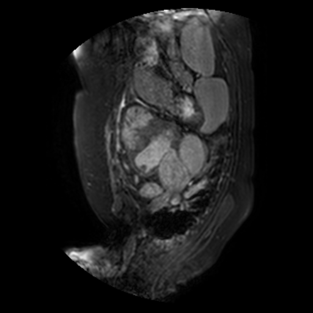</td>
<td>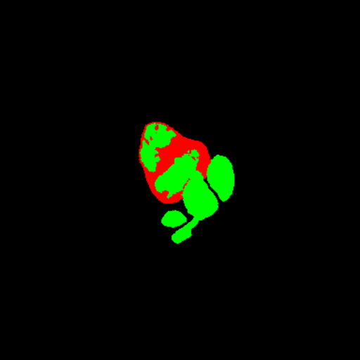</td>
<td>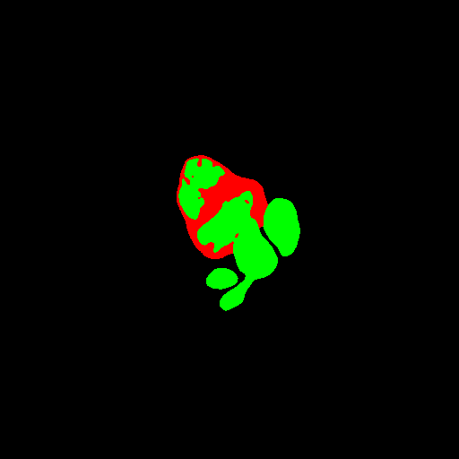</td>
</tr>
<tr>
<td>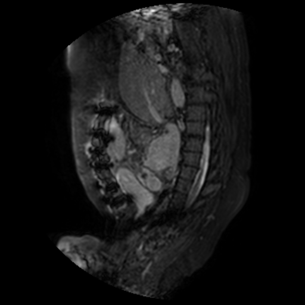</td>
<td>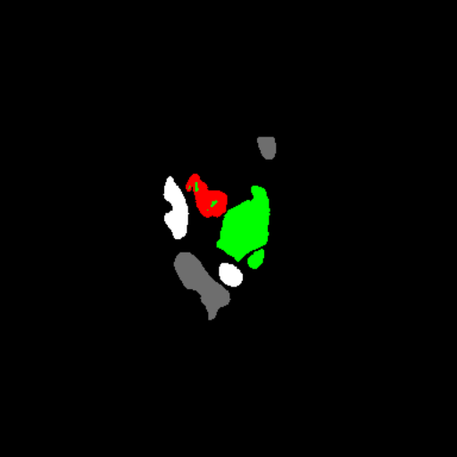</td>
<td></td>
</tr>
</table>

 

<h3>
References
</h3>
<b>1. 3D Whole Heart Imaging for Congenital Heart Disease</b> 
Gerald Greil, Animesh (Aashoo) Tandon, Miguel Silva Vieira, Tarique Hussain  
<a href="https://pmc.ncbi.nlm.nih.gov/articles/PMC5327357/">https://pmc.ncbi.nlm.nih.gov/articles/PMC5327357/</a>
 
 
<b>2. Dilated Convolutional Neural Networks for Cardiovascular 
 MR Segmentation in Congenital Heart Disease</b> 
Jelmer M. Wolterink, Tim Leiner, Max A. Viergever, Ivana Isgum  
<a href="https://arxiv.org/pdf/1704.03669">https://arxiv.org/pdf/1704.03669</a>
 
 
<b>3. HVSMR-2.0: A 3D cardiovascular MR dataset for whole-heart segmentation in congenital heart disease</b> 
Danielle F. Pace, Hannah T. M. Contreras, Jennifer Romanowicz, Shruti Ghelani, Imon Rahaman, Yue Zhang, Patricia Gao, 
 Mohammad Imrul Jubair, Tom Yeh, Polina Golland, Tal Geva, Sunil Ghelani, Andrew J. Powell & Mehdi Hedjazi Moghari 
 
<a href="https://www.nature.com/articles/s41597-024-03469-9">
https://www.nature.com/articles/s41597-024-03469-9
</a>
 
<a href="https://people.csail.mit.edu/dfpace/assets/publications/HVSMR-2.0.pdf">
HVSMR-2.0: A 3D cardiovascular MR dataset for whole-heart segmentation in congenital  heart disease</a>
 
 
<b>4. A novel hybrid layer-based encoder–decoder framework for 3D segmentation in congenital heart disease</b> 
Yaoxi Zhu, Hongbo Li, Bingxin Cao, Kun Huang & Jinping Liu 
<a href="https://www.nature.com/articles/s41598-025-96251-9">
https://www.nature.com/articles/s41598-025-96251-9
</a>
 
 
<b>5. TensorFlow-FlexUNet-Image-Segmentation-Model</b> 
Toshiyuki Arai antillia.com  
<a href="https://github.com/sarah-antillia/TensorFlow-FlexUNet-Image-Segmentation-Model">
https://github.com/sarah-antillia/TensorFlow-FlexUNet-Image-Segmentation-Model
</a>
 
 
<b>6. TensorFlow-FlexUNet-Image-Segmentation-Whole-Heart-HVSMR-2.0</b> 
Toshiyuki Arai antillia.com  
<a href="https://github.com/sarah-antillia/TensorFlow-FlexUNet-Image-Segmentation-Whole-Heart-HVSMR-2.0">
https://github.com/sarah-antillia/TensorFlow-FlexUNet-Image-Segmentation-Whole-Heart-HVSMR-2.0
</a>
 
 
